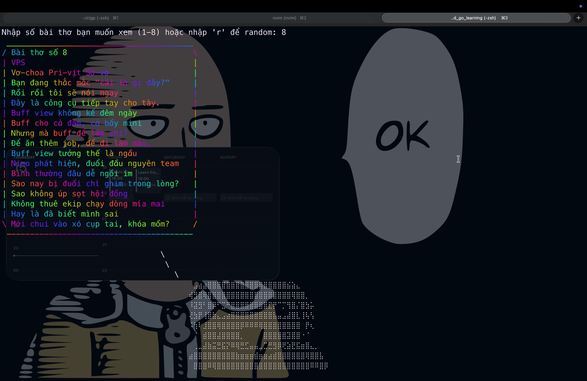

# 📝 Tuyển tập thơ Đại thi hào Ô LÔ ĐÔ (CLI Edition)

Ứng dụng dòng lệnh (CLI) được viết bằng **Go**.

## Hướng dẫn chạy chương trình

Nếu bạn đã cài đặt Go trên máy tính:

```bash
go run main.go
```

```bash
go build -o main main.go

./main

```

## Usage

Khi chương trình khởi chạy, bạn sẽ thấy yêu cầu nhập dữ liệu:

1. **Chọn số (1-8):** Để đọc bài thơ tương ứng theo thứ tự trong danh sách.
2. **Nhập 'r':** Để hệ thống chọn ngẫu nhiên một bài thơ bất kỳ

## 🖼️ Demo hình ảnh



## 📚 Tài liệu tham khảo (References)

- [Go Tutorial: Cowsay](https://thevalleyofcode.com/go-tutorial-cowsay/) - Hướng dẫn xây dựng ứng dụng Cowsay bằng Golang.
- **Nhà thơ Ô LÔ ĐÔ** - Cung cấp nội dung thơ độc quyền cho tuyển tập này.
